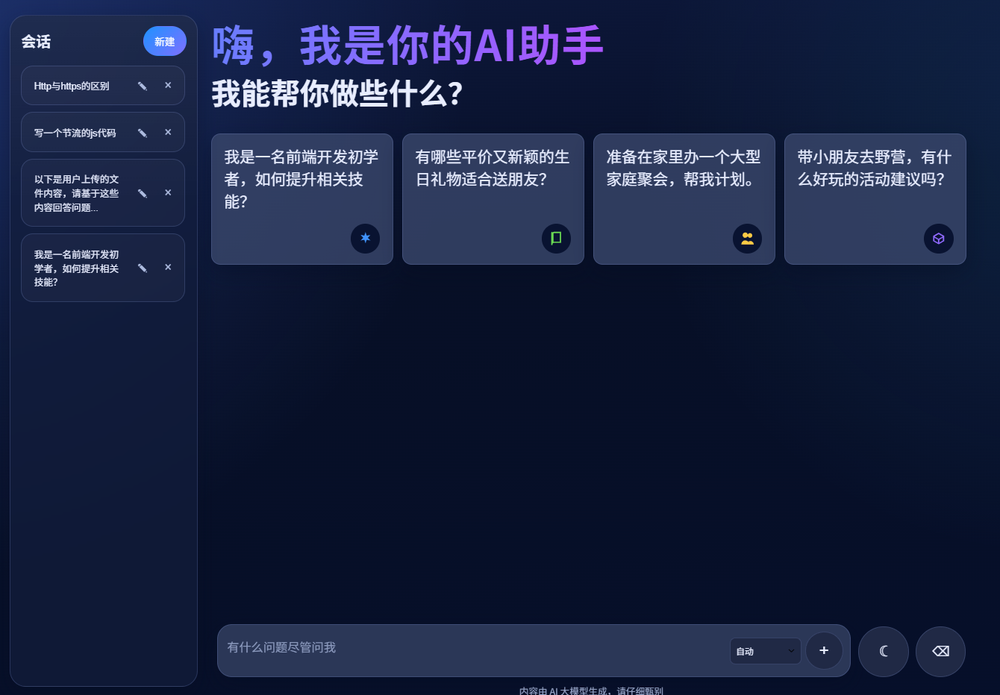
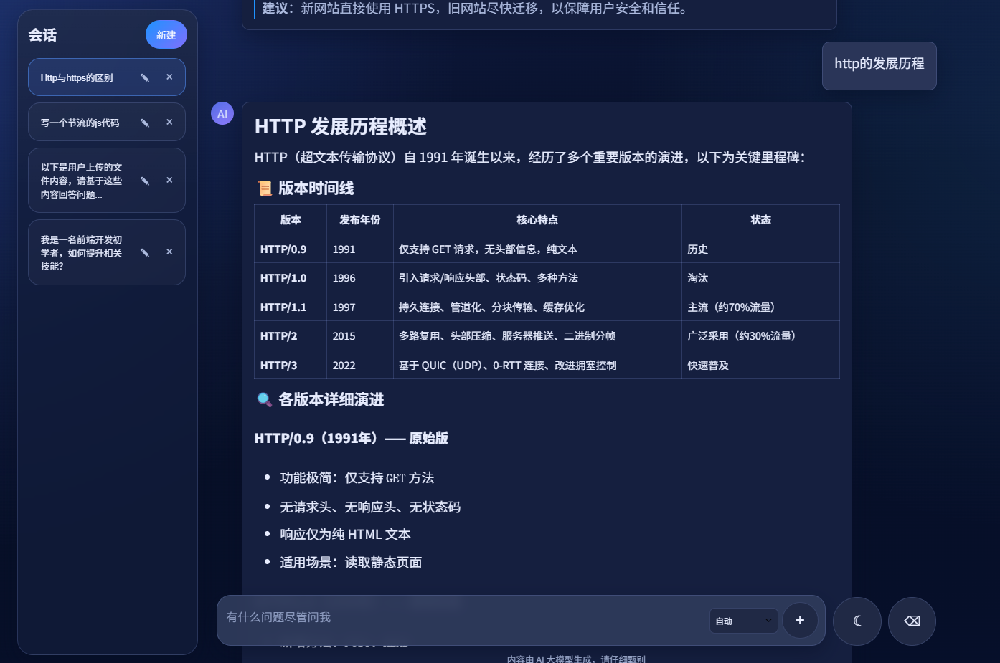
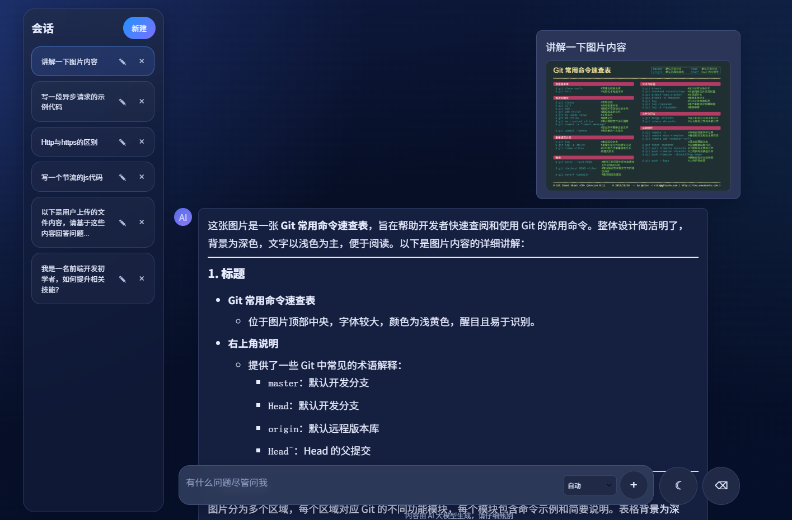

# 多会话 AI 聊天工作台

一个基于 React + TypeScript 的 AI 多会话聊天工作台前端项目，支持多会话管理、SSE 流式对话、模型切换、图片/文本文件上传、Markdown 渲染与本地持久化恢复。

## 项目预览

### 首页



### 聊天页



### 文件上传



## 技术栈

- React
- TypeScript
- Zustand
- React Router
- Vite
- marked / DOMPurify / highlight.js
- Vitest / Testing Library / Playwright

## 核心能力

### 1. 多会话管理

项目将每个会话建模为独立工作单元，单个会话中维护：

- 会话标题与更新时间
- UI 展示消息
- 模型请求历史
- 输入框草稿
- 上传中的图片和文本文件
- 当前会话流式生成状态

核心状态结构：

```ts
conversations: Record<string, Conversation>
orderedConversationIds: string[]
currentConversationId: string | null
```

这样做可以让会话查找、排序、切换和删除逻辑更加清晰，也方便和 `/chat/:conversationId` 路由参数配合。

### 2. 消息双轨设计

项目没有只维护一份聊天消息，而是拆成两类：

- `messages`：页面渲染用，支持消息 ID、助手占位、流式更新、错误提示和图片展示。
- `chatHistory`：模型请求用，只保存真正参与上下文的 user/assistant 消息。

这种设计可以避免 UI 临时状态进入模型上下文，降低流式生成、停止回滚和多模态消息组装的维护成本。

### 3. SSE 流式对话

服务层通过 `fetch` 获取流式响应：

```ts
const reader = response.body.getReader()
const decoder = new TextDecoder("utf-8")
```

然后按 SSE 的 `data:` 行解析增量 JSON，读取：

```ts
choices[0].delta.content
```

每次收到增量内容后，累加为完整文本，并回填到当前助手占位消息中，实现流式输出效果。

### 4. 多模态上传

图片和文本文件采用不同处理通道：

- 图片：选择后使用 `URL.createObjectURL` 做本地预览，发送时转为 Data URL 并组装为 `image_url`。
- 文本文件：使用 `File.text()` 异步读取内容，拼接为结构化 prompt 注入到用户问题中。

项目限制单文件最大 1MB，并设置文本上下文预算，避免超长文件直接撑满模型上下文。

## 项目结构

```text
src
├─ components        # 页面组件：侧边栏、聊天面板、输入区、欢迎区
├─ hooks             # 业务流程 Hook：发送消息、文件处理、会话管理、页面副作用
├─ services          # 模型接口请求与 SSE 解析
├─ store             # Zustand 多会话状态管理
├─ styles            # 全局样式、主题、响应式布局
├─ types             # 聊天领域类型定义
├─ utils             # Markdown、文件上传、消息组装等工具函数
└─ route             # React Router 路由配置
```

## 本地运行

安装依赖：

```bash
npm install
```

启动开发服务：

```bash
前端：
npm run dev

后端：
npm run server
```

运行单元测试：

```bash
npm test
```

运行端到端测试：

```bash
npm run test:e2e
```

构建项目：

```bash
npm run build
```

## 模型配置

项目支持 Qwen/灵析 与 DeepSeek 两类模型。开发环境中通过 Vite proxy 将同源请求转发到真实模型接口：

- `/api/chat/completions`
- `/api-intl/chat/completions`
- `/deepseek/chat/completions`

首次发送消息时，如果本地没有对应 API Key，会提示用户输入并保存到 localStorage。

> 说明：localStorage 保存 API Key 更适合本地演示和学习场景。生产环境建议改为后端代理，由服务端安全管理密钥。

## 测试情况

当前测试覆盖：

- Store 会话状态与辅助函数
- 消息发送 Hook
- 文件上传工具函数
- API 服务层逻辑
- Composer / ChatPanel / WelcomeSection 组件交互
- 首页提问到聊天页响应的 E2E 流程

当前测试结果：

```text
Test Files  9 passed
Tests       51 passed
```

## 可继续优化方向

- 长会话历史裁剪、摘要压缩或 token 预算控制
- 文件问答升级为 RAG：文件切片、向量检索、相关片段召回
- API Key 改为后端代理存储，提升生产安全性
- 增加会话搜索、置顶、归档等工作台能力
- 完善更多 E2E 场景，如停止生成、上传文件、多会话切换
