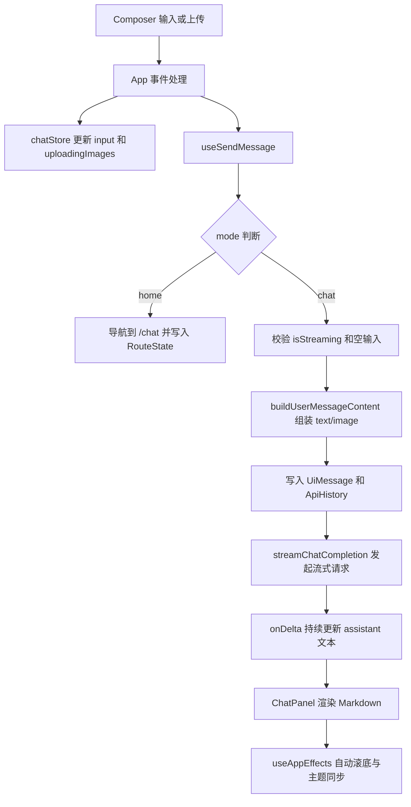

# 灵犀 React 项目学习指南（面向初学者）

本文档面向刚接触 React + TypeScript 的同学，目标是帮助你快速理解这个项目：目录怎么拆、每个文件做什么、数据怎么流动、为什么这么设计。

## 项目一句话介绍

这是一个支持文本和图片多模态输入的 AI 聊天前端，具备：

- 首页快捷提问
- 聊天页流式回复
- Markdown 渲染与代码高亮复制
- 主题切换
- 上传图片预览与发送
- 端点容错回退

---

## 1. 目录结构拆解（文件功能 + 设计思路）

### 1.1 根目录

| 文件/目录              | 功能               | 设计思路                                                                                   |
| ---------------------- | ------------------ | ------------------------------------------------------------------------------------------ |
| `package.json`         | 项目脚本与依赖声明 | 通过 Vite + React + TS 最小化工程配置；依赖聚焦在路由、状态管理、Markdown 渲染和安全净化。 |
| `index.html`           | 前端宿主页面       | 预加载两套代码高亮主题 CSS，并通过 id 让运行时动态切换明暗主题。                           |
| `vite.config.ts`       | Vite 构建配置      | 仅保留 React 插件，保持配置简洁，业务复杂度放到应用层。                                    |
| `eslint.config.js`     | ESLint 规则        | 使用 TS + React Hooks + React Refresh 推荐规则，保证开发期质量。                           |
| `tsconfig.json`        | TS 总配置入口      | 通过 references 分离 app/node 两套编译上下文。                                             |
| `tsconfig.app.json`    | 浏览器端 TS 配置   | 启用严格模式和 bundler 模式，保证类型安全与现代构建兼容。                                  |
| `tsconfig.node.json`   | Node 侧 TS 配置    | 用于 Vite 配置文件等 Node 场景的类型检查。                                                 |
| `README.md`            | 模板说明文档       | 当前仍是 Vite 模板初始内容，可后续替换为项目专属说明。                                     |
| `docs/项目学习指南.md` | 本学习文档         | 统一沉淀项目架构、实体、流程与学习路径。                                                   |

### 1.2 public 目录

| 文件/目录                                | 功能             | 设计思路                                           |
| ---------------------------------------- | ---------------- | -------------------------------------------------- |
| `public/vendor/hljs-github-dark.min.css` | 暗色代码高亮主题 | 与亮色主题配对，运行时切换，避免重新拉取样式。     |
| `public/vendor/hljs-github.min.css`      | 亮色代码高亮主题 | 通过 `disabled` 切换，和 `body[data-theme]` 联动。 |
| `public/favicon.svg`                     | 浏览器标签图标   | 品牌基础资源。                                     |
| `public/icons.svg`                       | 图标资源集合     | 作为静态资源保留。                                 |

### 1.3 src 目录总览

#### 入口与路由

| 文件                   | 功能                           | 设计思路                                                         |
| ---------------------- | ------------------------------ | ---------------------------------------------------------------- |
| `src/main.tsx`         | 应用入口，挂载根组件与全局样式 | 入口保持“薄”，只做初始化，不放业务逻辑。                         |
| `src/route/index.tsx`  | 路由提供者封装                 | 把 RouterProvider 抽成独立组件，入口更简洁。                     |
| `src/route/router.tsx` | 路由表定义                     | 首页与聊天页复用同一 App，通过 `mode` 区分行为；兜底路由重定向。 |

#### 页面编排层

| 文件          | 功能                           | 设计思路                                         |
| ------------- | ------------------------------ | ------------------------------------------------ |
| `src/App.tsx` | 主容器，组织页面结构与事件编排 | 只做“流程协调”，把副作用和发送逻辑下沉到 hooks。 |

#### 组件层

| 文件                                | 功能                                         | 设计思路                                                   |
| ----------------------------------- | -------------------------------------------- | ---------------------------------------------------------- |
| `src/components/WelcomeSection.tsx` | 空会话欢迎区和快捷提问卡片                   | 与聊天区分离，清晰表达“首页引导态”。                       |
| `src/components/ChatPanel.tsx`      | 消息列表渲染（用户/助手分流）                | 助手消息 Markdown 渲染，用户消息结构化直出，降低安全风险。 |
| `src/components/Composer.tsx`       | 输入区（输入、上传、发送、停止、主题、清空） | 组件只做展示和事件回调，不直接写业务逻辑。                 |

#### Hooks 层（流程抽象）

| 文件                          | 功能                 | 设计思路                                       |
| ----------------------------- | -------------------- | ---------------------------------------------- |
| `src/hooks/useSendMessage.ts` | 消息发送全流程       | 把复杂发送链路从 App 抽离，便于维护和测试。    |
| `src/hooks/useAppEffects.ts`  | 页面级副作用统一管理 | 主题切换、输入框高度、滚动、资源清理集中处理。 |

#### 状态管理层

| 文件                     | 功能                        | 设计思路                                                     |
| ------------------------ | --------------------------- | ------------------------------------------------------------ |
| `src/store/chatStore.ts` | 全局聊天状态中心（Zustand） | UI 展示消息与 API 历史消息分轨存储，保证展示灵活与请求正确。 |

#### 服务层

| 文件                  | 功能                             | 设计思路                                |
| --------------------- | -------------------------------- | --------------------------------------- |
| `src/services/api.ts` | 请求模型接口，流式解析与端点回退 | 服务层只关心请求/响应，不掺杂 UI 逻辑。 |

#### 类型层

| 文件                | 功能             | 设计思路                               |
| ------------------- | ---------------- | -------------------------------------- |
| `src/types/chat.ts` | 聊天领域核心类型 | 先建模后实现，保证结构清晰和类型约束。 |

#### 工具层

| 文件                          | 功能                            | 设计思路                                     |
| ----------------------------- | ------------------------------- | -------------------------------------------- |
| `src/utils/helpers.ts`        | 通用工具（key、转义、滚动、id） | 小函数单一职责，避免组件重复。               |
| `src/utils/markdown.ts`       | Markdown 渲染增强               | 解析、净化、高亮、复制按钮分层处理。         |
| `src/utils/messageContent.ts` | 组装多模态消息内容              | 把 File 转 data URL 和消息片段组装独立出来。 |

#### 常量层

| 文件               | 功能         | 设计思路                             |
| ------------------ | ------------ | ------------------------------------ |
| `src/constants.ts` | 常量集中管理 | 端点、模型、存储键、快捷语统一维护。 |

#### 样式层

| 文件                        | 功能                  | 设计思路                                     |
| --------------------------- | --------------------- | -------------------------------------------- |
| `src/styles/index.css`      | 样式聚合入口          | 按“主题 -> 基础 -> 区块 -> 响应式”顺序加载。 |
| `src/styles/theme.css`      | 主题变量              | CSS 变量 + `data-theme` 实现亮暗模式切换。   |
| `src/styles/base.css`       | 全局基础样式          | 重置、背景层、主布局、通用动画。             |
| `src/styles/welcome.css`    | 欢迎区样式            | 负责品牌标题和快捷卡片视觉。                 |
| `src/styles/chat.css`       | 聊天区样式            | 消息气泡、Markdown、代码块与图片网格。       |
| `src/styles/composer.css`   | 输入区样式            | 固定底部输入区与上传预览交互。               |
| `src/styles/responsive.css` | 响应式样式            | 平板/手机断点下布局优化。                    |
| `src/App.css`               | Vite 模板遗留样式     | 当前业务未使用，可后续清理。                 |
| `src/index.css`             | Vite 模板遗留全局样式 | 当前主入口已改为 `src/styles/index.css`。    |

#### 资源文件

| 文件                   | 功能             | 设计思路                   |
| ---------------------- | ---------------- | -------------------------- |
| `src/assets/hero.png`  | 视觉素材（保留） | 为后续欢迎页视觉迭代预留。 |
| `src/assets/react.svg` | 模板遗留资源     | 可按需清理。               |
| `src/assets/vite.svg`  | 模板遗留资源     | 可按需清理。               |

---

## 2. 项目中的所有实体结构

下面按“领域实体 -> 状态实体 -> 过程参数实体”梳理。

### 2.1 领域实体（`src/types/chat.ts`）

1. `Role`

- `"user" | "assistant"`
- 表示消息角色。

2. `ThemeMode`

- `"dark" | "light"`
- 表示主题模式。

3. `ImagePart`

- 结构：`{ type: "image_url", image_url: { url: string } }`
- 用于多模态图片片段。

4. `TextPart`

- 结构：`{ type: "text", text: string }`
- 用于多模态文本片段。

5. `MessagePart`

- `ImagePart | TextPart`
- 多模态片段联合类型。

6. `ApiMessage`

- 结构：`{ role: Role, content: string | MessagePart[] }`
- 发给模型的消息结构。

7. `UiMessage`

- 结构：`{ id, role, text, content? }`
- 页面渲染结构，支持文本和图片展示。

8. `UploadingImage`

- 结构：`{ id, file, url }`
- 上传中的图片实体；`url` 用于预览，`file` 用于编码发送。

### 2.2 状态实体（`src/store/chatStore.ts`）

1. 状态字段

- `input`
- `theme`
- `isStreaming`
- `abortController`
- `messages`
- `chatHistory`
- `uploadingImages`

2. 状态操作

- 输入与主题：`setInput` `setTheme` `toggleTheme`
- 流式控制：`setStreaming` `setAbortController`
- UI 消息：`addUiMessage` `updateUiMessageText`
- 历史消息：`pushHistory` `removeHistoryMessage`
- 会话与上传：`clearConversation` `addUploadingImages` `removeUploadingImage` `clearUploadingImages`

### 2.3 过程参数实体

1. `RouteState`（`src/App.tsx`）

- `draftPrompt?: string`
- `shouldAutoSend?: boolean`
- 用于首页跳转聊天页时触发自动发送（支持仅图片场景）。

2. `UseSendMessageParams`（`src/hooks/useSendMessage.ts`）

- 发送流程依赖注入集合（状态、导航、回调方法）。

3. `UseAppEffectsParams`（`src/hooks/useAppEffects.ts`）

- 副作用 Hook 依赖注入集合。

4. `ApiError`（`src/services/api.ts`）

- 扩展 Error：`status?` `endpoint?`
- 用于错误分级与端点定位。

---

## 3. 已完成功能与对应文件

### 3.1 聊天核心

1. 文本发送与流式回复

- `src/hooks/useSendMessage.ts`
- `src/services/api.ts`
- `src/store/chatStore.ts`
- `src/components/ChatPanel.tsx`

2. Markdown 渲染 + 代码高亮 + 一键复制

- `src/utils/markdown.ts`
- `src/components/ChatPanel.tsx`
- `public/vendor/*.css`

3. 停止生成（AbortController）

- `src/App.tsx`
- `src/hooks/useSendMessage.ts`
- `src/store/chatStore.ts`

### 3.2 多模态能力

1. 图片上传预览、删除、清理

- `src/components/Composer.tsx`
- `src/App.tsx`
- `src/store/chatStore.ts`

2. 图文消息构建与视觉模型自动切换

- `src/utils/messageContent.ts`
- `src/services/api.ts`

3. 首页上传图片跳转聊天页不丢失

- `src/hooks/useSendMessage.ts`
- `src/App.tsx`

### 3.3 体验能力

1. 欢迎页快捷卡片

- `src/components/WelcomeSection.tsx`
- `src/constants.ts`

2. 主题切换（含代码高亮主题联动）

- `src/store/chatStore.ts`
- `src/hooks/useAppEffects.ts`
- `index.html`

3. 输入框自适应 + 自动滚底

- `src/hooks/useAppEffects.ts`
- `src/utils/helpers.ts`

4. 错误提示分级（401/403/429/400/网络）

- `src/hooks/useSendMessage.ts`

5. 端点容错回退（国内/国际或自定义）

- `src/constants.ts`
- `src/services/api.ts`

---

## 4. 给初学者的学习建议（如何读这个项目）

### 第一阶段：先跑起来

1. 读 `package.json` 看脚本
2. 读 `src/main.tsx` 看入口
3. 读 `src/route/router.tsx` 看页面切换

### 第二阶段：看页面如何“拼起来”

1. 读 `src/App.tsx`：只关心它如何组织三个组件
2. 看三个组件：

- `src/components/WelcomeSection.tsx`
- `src/components/ChatPanel.tsx`
- `src/components/Composer.tsx`

### 第三阶段：看“消息怎么发送”

1. 读 `src/hooks/useSendMessage.ts`（最关键）
2. 再读 `src/services/api.ts`（请求、流式、回退）
3. 对照 `src/store/chatStore.ts` 理解状态怎么变

### 第四阶段：看“多模态和安全”

1. `src/utils/messageContent.ts`：图片如何变成可发送内容
2. `src/utils/markdown.ts`：为什么要 DOMPurify（防 XSS）

### 第五阶段：看样式与响应式

1. `src/styles/theme.css` 看变量系统
2. `src/styles/composer.css` 看交互区布局
3. `src/styles/responsive.css` 看断点策略

---

## 5. 总体设计思路与文件数据传输流程

## 5.1 架构分层思想

- 组件层：只渲染和上抛事件
- Hook 层：组织页面流程（发送流程、副作用流程）
- Store 层：统一状态读写
- Service 层：网络请求和流式解析
- Utils 层：纯工具和通用能力
- Types/Constants：规则与约束中心

这样的好处是：

- 复杂逻辑不堆在一个组件
- 新手更容易定位问题
- 功能扩展时影响面更可控

### 5.2 关键数据流（文字版）

1. 用户输入文本/选择图片

- `Composer` 触发事件
- `App` 调用 store 更新 `input`/`uploadingImages`

2. 点击发送

- `App` 调 `sendMessage`
- `useSendMessage` 判空/判流式/校验 key

3. 构建消息

- `buildUserMessageContent` 把图片转 data URL
- 生成 `ApiMessage`（发模型）和 `UiMessage`（页面展示）

4. 发起流式请求

- `streamChatCompletion` 选端点 + 选模型 + 解析 SSE
- `onDelta` 持续回写 store 中助手消息文本

5. 界面更新

- `ChatPanel` 订阅到 store 变化自动重渲染
- `useAppEffects` 自动滚动到底部

6. 收尾

- 成功：助手文本写入历史
- 失败：分级错误提示
- 中断：回滚当轮历史并释放状态

### 5.3 首页 -> 聊天页带图发送流程（重点）

1. 首页模式下，`useSendMessage` 不直接请求
2. 携带 `draftPrompt + shouldAutoSend` 跳转 `/chat`
3. `App` 在聊天页 `useEffect` 捕获路由 state
4. 即使只有图片、没有文本，也能触发自动发送
5. 发送完成后清理路由 state，避免重复触发

### 5.4 流程图（Mermaid）

---

## 6. 用到的技术与详细介绍

### 6.1 React 19

- 用途：组件化 UI 构建
- 在本项目中的角色：
  - 组件渲染（Welcome、ChatPanel、Composer）
  - Hook 组织副作用与流程（useEffect/useCallback）

### 6.2 TypeScript 6

- 用途：静态类型系统
- 在本项目中的角色：
  - 领域建模（ApiMessage、UiMessage、UploadingImage）
  - 参数约束（UseSendMessageParams 等）
  - 降低重构风险

### 6.3 React Router DOM 7

- 用途：前端路由
- 在本项目中的角色：
  - 首页与聊天页模式切换
  - 通过 `location.state` 传递跳转上下文

### 6.4 Zustand

- 用途：轻量状态管理
- 在本项目中的角色：
  - 管理会话、消息、上传图片、主题、流式状态
  - 将 UI 展示状态与模型上下文状态统一可追踪

### 6.5 Marked + DOMPurify + highlight.js

1. Marked

- 负责把 Markdown 转 HTML

2. DOMPurify

- 负责净化 HTML，防止注入风险

3. highlight.js

- 负责代码语法高亮

组合价值：

- 保证“可读性 + 可用性 + 基本安全性”

### 6.6 Vite

- 用途：开发服务器和构建工具
- 在本项目中的角色：
  - 快速热更新
  - 生产构建打包

### 6.7 Fetch + SSE 解析

- 用途：对接流式聊天接口
- 在本项目中的角色：
  - 解析 `data:` 行增量内容
  - 通过 onDelta 实现打字机输出

---

## 7. 项目亮点

1. 清晰分层，适合学习

- App 编排、Hook 流程、Store 状态、Service 请求、Utils 工具职责边界明确。

2. 多模态支持自然

- 同一发送流程支持文本、图文、仅图片。

3. 首页到聊天页的无缝衔接

- 借助 RouteState 自动首发消息，用户感知连续。

4. 端点回退容错

- 自定义端点优先，默认端点兜底，网络异常可自动切换。

5. 消息双轨存储

- `UiMessage` 与 `ApiMessage` 分离，展示与请求互不牵扯。

6. 错误处理友好

- 对常见错误类型给出具体、可执行的提示。

7. 样式体系工程化

- 变量主题 + 模块样式 + 响应式断点，结构可扩展。

8. 资源清理意识强

- 上传预览 URL 在删除、清空、卸载多个环节都做释放。

---

## 附：后续可演进方向

1. 增加单元测试

- 重点覆盖 `useSendMessage` 与 `services/api`。

2. 增加设置页

- 支持模型切换、端点设置、温度参数配置。

3. 会话持久化

- 将历史消息保存到 localStorage 或后端。

4. 代码分包优化

- 当前构建有 chunk 体积告警，可做按路由或按能力懒加载。

5. 清理模板遗留

- 评估后移除 `src/App.css`、`src/index.css` 与无用 assets。
